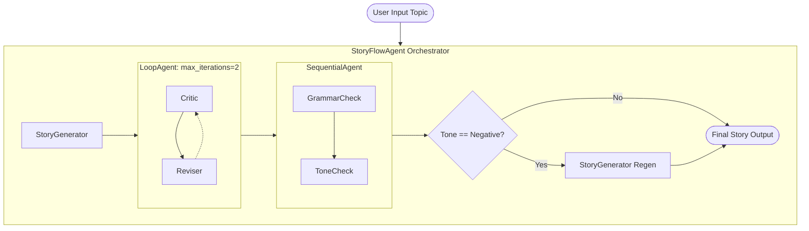

# test02

A collection of Python scripts demonstrating various Google Cloud services, including Generative AI and Natural Language processing.

## Scripts Overview

### `flash-lite-test.py`
This script uses the `google-genai` library to interact with the `gemini-3.1-flash-lite-preview` model. It is configured to:
- Generate summaries based on a user's prompt (e.g., "summarize the events from yesterday").
- Utilize **Google Search** as a tool for enhanced information retrieval.
- Use **Vertex AI** for model execution.
- Include custom safety settings and thinking configuration.

### `ner.py`
This script demonstrates Named Entity Recognition (NER) using the `google-cloud-language` API. It:
- Analyzes text content for entities such as persons, locations, and organizations.
- Outputs representative names, entity types, salience scores, and metadata (like Wikipedia URLs).
- Detects mentions of entities within the text.

### `long_running_agent/agent.py`
This module demonstrates an advanced Google ADK multi-agent architecture capable of executing and tracking long-running asynchronous background tasks without blocking the main conversational flow.
- A `starter_agent` dispatches non-blocking background threads (e.g. generating financial reports) and leaves state tokens on the file system.
- A `checker_agent` synchronously retrieves and passes the report output cleanly back to the LLM.
- The `root_agent` orchestrates user queries seamlessly between the two sub-agents, handling asynchronous check-ins dynamically within the natural chat interaction.

### `storyflow.py`
Demonstrates a complex deterministic workflow using ADK's `BaseAgent`, `LoopAgent`, and `SequentialAgent`. It chains multiple distinct LLMs to iteratively write, critique, revise, and QA a short story, dynamically routing execution based on tone analysis. The final resulting story is automatically written out to a `story.md` file in the working directory.



## Prerequisites

1.  **Google Cloud Project:** You must have a Google Cloud project with the Vertex AI and Natural Language APIs enabled.
2.  **Authentication:** Set up your application default credentials (ADC) to authenticate with Google Cloud.
    ```bash
    gcloud auth application-default login
    ```
3.  **Project ID:** Update the `project` ID in `flash-lite.py` to match your Google Cloud project.

## Installation

This project uses `uv` for package management. To install the dependencies, run:

```bash
uv sync
```

## Usage

### Run Gemini Flash Lite Script
To execute the generative AI summary:
```bash
uv run flash-lite.py
```

### Run Named Entity Recognition Script
To execute the NER analysis:
```bash
uv run ner.py
```

### Run Long-Running Agent
To experience the non-blocking asynchronous agent workflow, run the ADK web interface:
```bash
uv run adk web long_running_agent
```
Or interact with the orchestrator agent directly via command line:
```bash
uv run adk run long_running_agent
```

### Run StoryFlow Agent
To execute the multi-agent narrative chaining workflow:
```bash
uv run storyflow.py
```

## Dependencies
- `google-cloud-language`: For natural language processing and entity recognition.
- `google-genai`: For interacting with Google's generative models.
- `pyopenssl`: For secure network communications.
